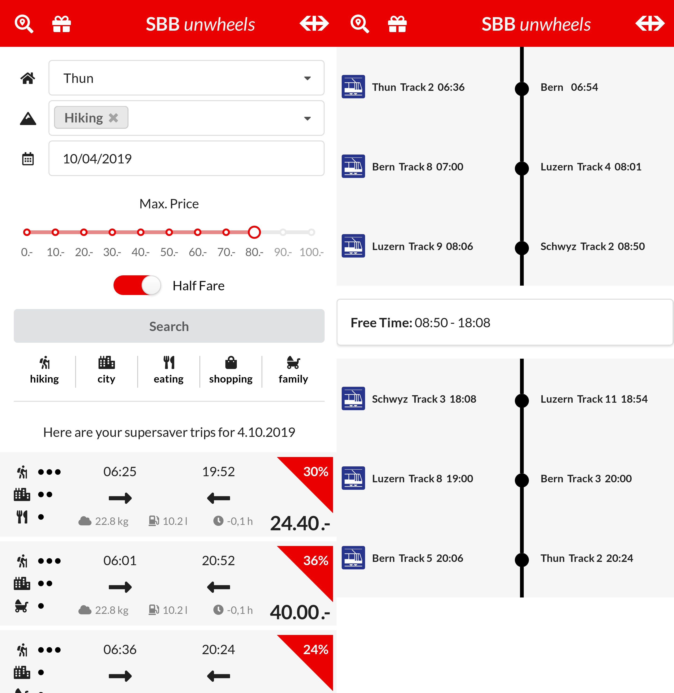

# SBB Unwheels

Our mission is providing Swiss people with the most relevant destinations for their activities, all at the best possible price - thanks to SBB super saver! We want to convince people to use public transport to explore Switzerland by providing them a cheaper, environmentally friendly means of transporation.

## How we built it

Our application is based on a pure JavaScript stack that includes NodeJS and ReactJS for the back- and frontend respectively. Data transmission is taken care of with GraphQL and the corresponding libraries.

## Requirements

Our application depends on a relatively recent version of NodeJS (v10+). The application frontend (React stack) can be installed using `npm install` and run with `npm start`, after which it will be available on `localhost:3000`. The backend can be installed and started similarly and will make available a GraphQL API at `localhost:4000`.
